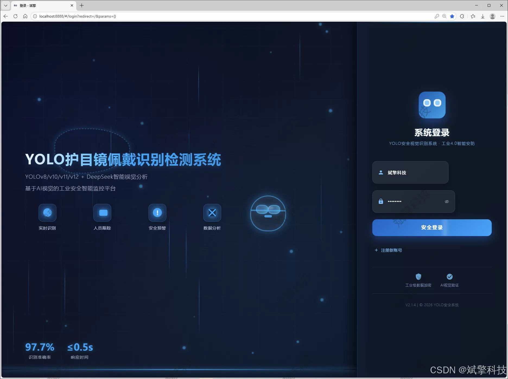
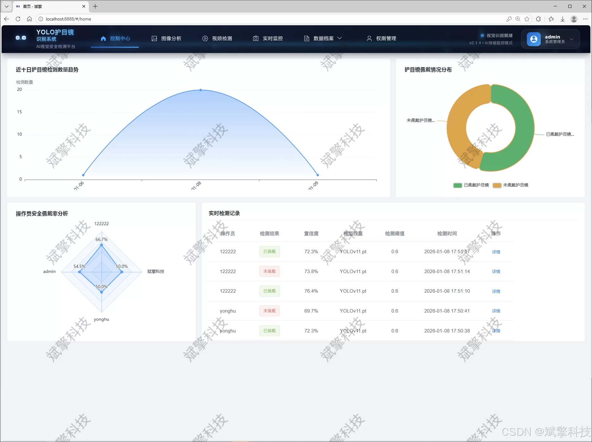
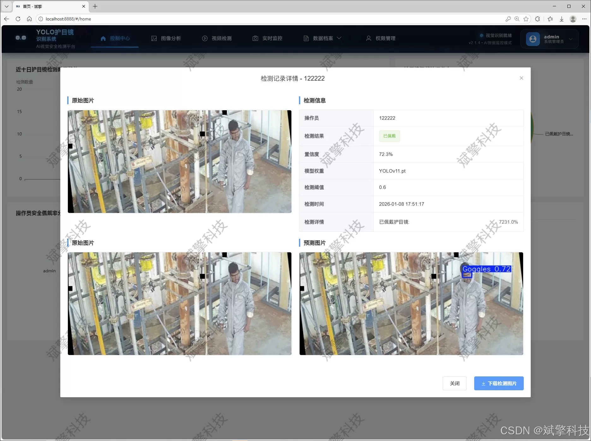
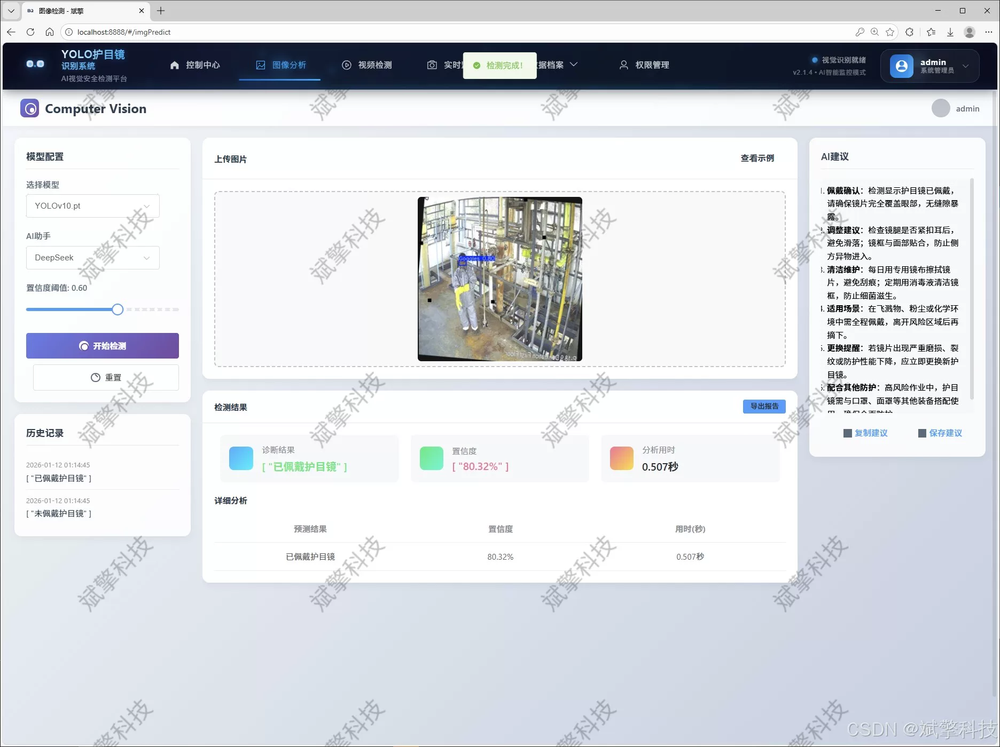
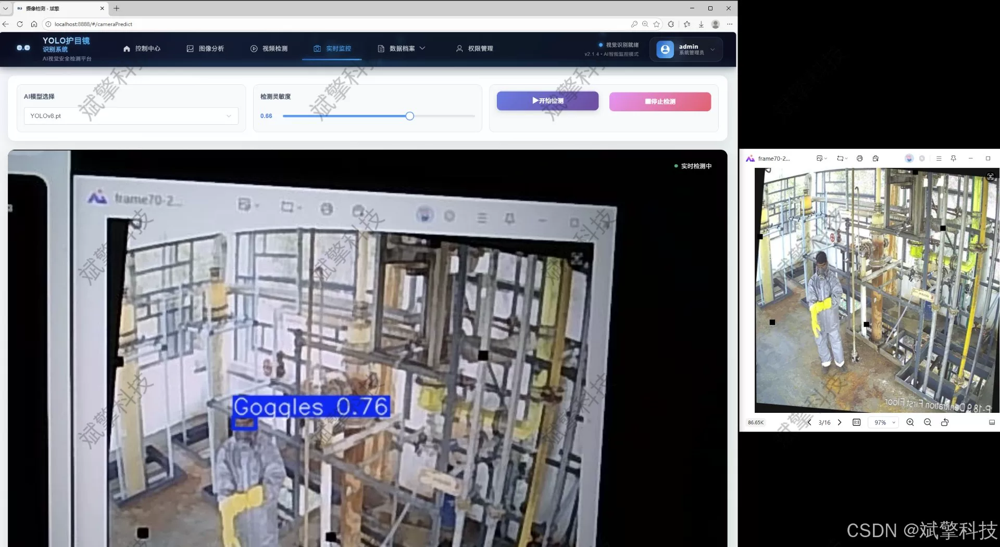
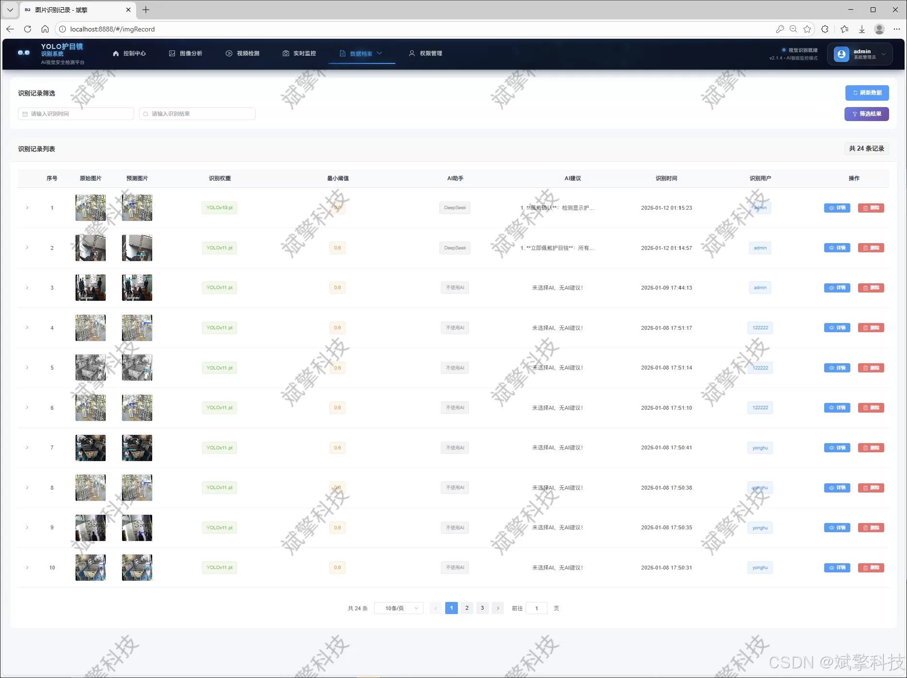
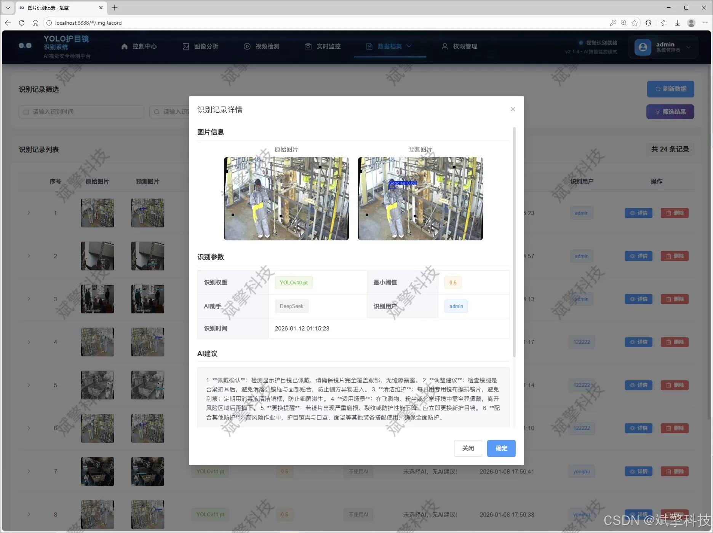
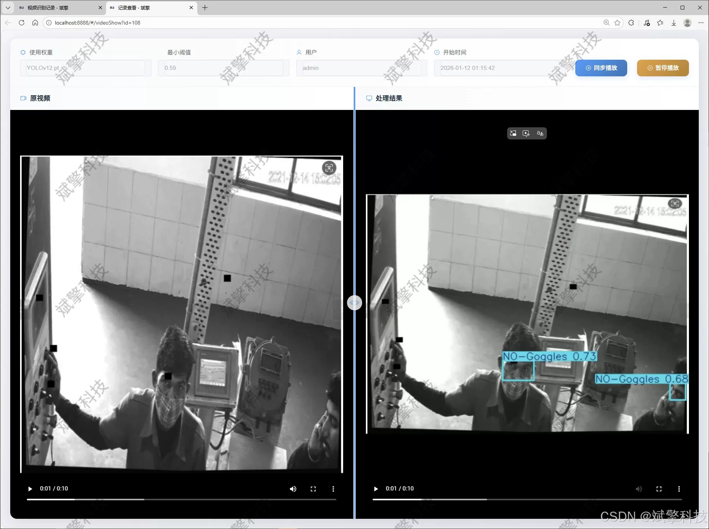
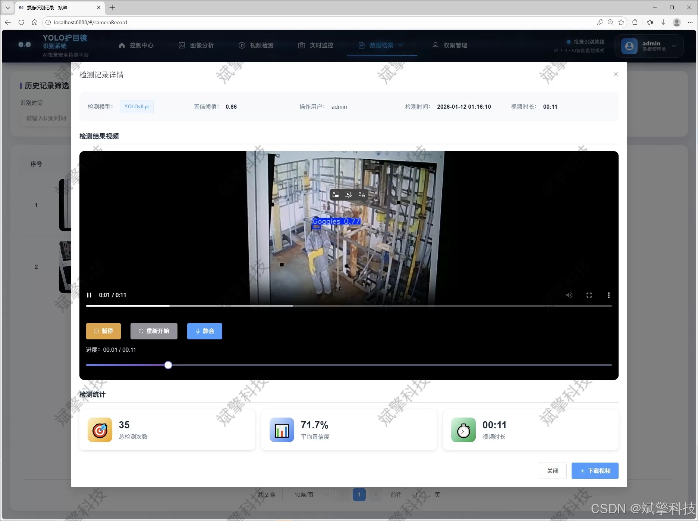

# YOLO goggles wearing detection

## Body

YOLO (You Only Look Once) is a deep learning-based object detection algorithm that can quickly and accurately detect objects in real-time. It has been widely used in various fields such as autonomous driving, robotics, and computer vision.

In this system, YOLO is used to detect whether a person is wearing a protective eyewear, such as goggles or safety glasses. The system consists of three main components: the DeepSeek intelligent analysis platform, the web interface for user interaction, and the YOLO data processing module.

The DeepSeek intelligent analysis platform is responsible for analyzing the input images and generating output results. It uses a large model like DeepSeek to perform complex image recognition tasks. The platform also provides a web interface for users to interact with the system and view the analysis results.

The YOLO data processing module is responsible for preprocessing the input images and generating YOLO outputs. It uses YOLOv8/YOLOv10/YOLOv11/YOLOv12 models to perform object detection tasks on the images. The processed YOLO outputs are then sent to the DeepSeek intelligent analysis platform for further analysis.

Overall, this system combines the strengths of YOLO and DeepSeek to provide a fast and accurate way to detect whether people are wearing protective eyewear.

The core technology of the system adopts the current state-of-the-art YOLO series algorithms in the field of target detection, and innovatively integrates four models: YOLOv8, YOLOv10, YOLOv11, and YOLOv12. This provides users with flexibility in choosing between performance and accuracy, facilitating model comparison and selection during actual deployment. The system's backend is built on the SpringBoot framework, achieving efficient business logic processing; the frontend uses modern web technologies to provide a friendly user interface. The overall architecture follows the principle of separating the frontend and backend, ensuring the system's maintainability, scalability, and high performance.

The system is comprehensive in functionality, covering the entire process from data input to analysis management. It supports three modes of operation: image detection, video stream analysis, and real-time camera detection, meeting the application needs in different scenarios. The detection process integrates DeepSeek's intelligent analysis capabilities, enhancing the system's interpretability and intelligence level. All detection results and operational logs are persistently stored in a MySQL database, ensuring traceability of data. The system also features a complete user system, including login registration, personal center information management, and comprehensive management functions for users and identification records (images, videos, cameras) by administrators. In addition, through a rich set of data visualization charts, the system intuitively displays detection statistics and system operational status, providing data support for security management decisions.

The system constructed in this project not only realizes the precise and real-time automatic detection of the wearing status of goggles, but also integrates artificial intelligence algorithms with information management through an integrated Web management platform, providing a set of efficient, reliable, and practical intelligent solutions for industrial safety production management.

Functional module

✅ User Login and Registration: Supports password detection, saves to MySQL database.

✅ Supports four YOLO model switches, YOLOv8, YOLOv10, YOLOv11, YOLOv12.

✅ Information Visualization, Data Visualization.

✅ Image detection supports AI analysis functions, deepseek and Qianwen.

✅ Supports image detection, video detection, and real-time camera detection. The results are saved to a MySQL database.

✅ Picture recognition record management, video recognition record management and camera recognition record management.

✅ User Management Module, administrators can add, delete, modify, and query users.

✅ Personal center, can modify their own information, password name profile picture and so on.

There is no Lunwen writing service, nor any Lunwen.

## Images

## Payment

Here is a pay link on Stripe ( https://buy.stripe.com/3cs8yP7sY87d0vu9AB ). Please contact me lonlonago@foxmail.com after funding $89, and I will send you a complete data files , thank you!

